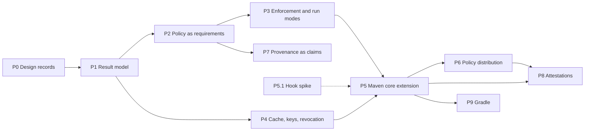

# Sigmund: Verification Roadmap

Status: living document. Updated in the same change that moves a task.

This is the working reference for evolving Sigmund's verification API and
implementation toward the [design direction](sigmund-verification-design-direction.md).
The three documents have distinct jobs:

| Document | Answers | Changes when |
|---|---|---|
| [Design direction](sigmund-verification-design-direction.md) | What and why | The design changes |
| This roadmap | In what order, and where we are | A task starts, finishes, splits, or is added |
| ADRs under [`adr/`](../adr) | What was decided, and the alternatives rejected | A decision is taken |

References such as §3.5 point to sections of the design direction.

---

## Working rules

- **No backward compatibility.** Sigmund has not been adopted. Types, config
  sections, plugin parameters and CLI options are replaced outright — no
  migration code, deprecated aliases or legacy schema readers.
- **Every phase ends in something demonstrable.** A phase is not done until its
  demo runs.
- **Every task ships with tests and docs.** Unit tests for all changes;
  integration tests where a task changes observable plugin or CLI behaviour.
  Affected pages under `docs/` and `AGENTS.md` are updated in the same change.
- **Task IDs are stable.** New tasks are appended to a phase with the next free
  number; tasks are never renumbered. A task that splits keeps its ID with a
  letter suffix (`P1.5a`, `P1.5b`).
- **Decisions go to ADRs, not here.** When a task settles something the design
  direction leaves open, record it as an ADR and link it from the decision log
  below.

Status values: `todo`, `in progress`, `done`, `blocked` (with the blocking
question linked), `dropped` (with a one-line reason).

---

## Baseline

Where the code stands against the design direction at the start of this
roadmap. Kept so that task descriptions can be read without re-deriving it.

| Area | Current state | Direction |
|---|---|---|
| Claim vocabulary | `VerificationUnit` sealed over `OpenPgpVerificationUnit`, `SigstoreVerificationUnit` | `Claim` (§3.1) |
| Artifact-level verdict | `TrustVerdict`: `TRUSTED`, `UNTRUSTED`, `UNSIGNED`, `NOT_CONFIGURED`, `VERIFICATION_FAILED` | Six outcomes (§3.5) |
| Tool-level verdict | `Verdict`: `PASS`, `FAIL`, `NO_KEY`, `SKIPPED` | Verified, `FAILED`, `INDETERMINATE` with reason |
| Failure mapping | Malformed Sigstore bundle → `FAIL`; Sigstore infrastructure failure → exception; unsupported OpenPGP algorithm → `SKIPPED`, which makes hybrid `.asc` `UNTRUSTED` under `listed-evidence: all` without `sq` | Attack signal and infrastructure problems never collapse (§3.5, §3.2.1) |
| Result | `TrustResult`: identity, verdict, matched and unmatched evidence | Claim, artifact and run results (§3.2) |
| Subject | `ArtifactIdentity`: namespace, name, version — no classifier, extension or digest | GAV + classifier/extension + digest; purl projection (§3.2, §8) |
| Time | Not extracted | Claim time, verification time, evaluation basis (§3.4) |
| Policy | `trust` maps patterns to expected signers; `signature-optional`; `policy.on-untrusted`, `listed-evidence`, `unlisted-evidence` | Role-scoped requirements; per-outcome, per-scope enforcement (§3.2, §3.3, §3.6) |
| Arguments | `sigmund.onUntrusted` and `sigmund.listedEvidence` override policy | Arguments configure how, never what (§5.3) |
| Config location | Plugin default `${project.basedir}/sigmund.yaml`; `ConfigLoader` checks base dir, then `~/.config/sigmund` | One policy at the reactor root (§5.1) |
| Orchestration | Reporting, enforcement and the `signature-optional` pre-filter live in `VerifyMojo` | In core, shared by every insertion point (§2) |
| Insertion points | `verify` and `dependency-signers` goals, bound to `validate`, resolving project dependencies only | Goal and core extension with identical results (§2) |
| Caching | `KeyFetchCache` in memory per session; no result cache | Persistent result cache in the trust model (§3.7) |
| Revocation | Not handled | Reason-code aware (§3.8) |
| Discovery | Sidecar lookup inside `ArtifactFileResolver` | `ProvenanceSource` SPI (§4) |
| Gradle | Plugin on commit `54f0705`, not on `main` | Gradle backend or metadata interop (§2.2) |

---

## Phases

The hook spike (P5.1) depends on nothing and can run at any time; its answer
shapes P5 and is a question for the Maven maintainers (§9). P7 needs only P1
and P2, so it can move earlier if provenance demand appears. P4 can run in
parallel with P2 and P3 once P1.9 is done.

### P0 — Design records

Settle the decisions everything else is built on.

| ID | Task | Refs | Depends | Status |
|---|---|---|---|---|
| P0.1 | Check `Claim` for ambiguity against sigstore-java and OIDC/JWT types on the classpath; choose `Claim` or `VerifiableClaim` | §3.1 | — | todo |
| P0.2 | ADR: result model — claim, artifact and run levels; roll-up rules; claim-set modes | §3.2, §3.2.1, §3.5 | — | todo |
| P0.3 | ADR: policy schema — role-scoped requirements, claim-set mode, per-outcome and per-scope enforcement, what replaces `signature-optional`, matched-rule location | §3.2, §3.3, §3.6 | P0.2 | todo |

### P1 — Vocabulary and result model

Establish the result model while the SPI is not public. Validated against the
two claim shapes already shipping — detached `.asc` and Sigstore bundles.

| ID | Task | Refs | Depends | Status |
|---|---|---|---|---|
| P1.1 | Rename `VerificationUnit` and its permits to the claim vocabulary; `SignatureFormat.parse` returns claims; update `AGENTS.md` and architecture docs | §3.1 | P0.1 | todo |
| P1.2 | Subject: classifier, extension and digest on the artifact identity; algorithm-tagged digest type (SHA-256 required) shared by subject, evidence and policy digests; one-way purl projection; policy matching stays at GAV level | §3.2, §8 | — | todo |
| P1.3 | Tool results carry claim outcome and reason: `NO_KEY` → `key-unavailable`, unsupported algorithm → `unsupported-algorithm`, malformed evidence → `evidence-malformed` (Sigstore bundle parse currently `FAIL`), Sigstore trust-root failure → `trust-root-unavailable` (currently thrown) | §3.5 | P1.1 | todo |
| P1.4 | Temporal fields: OpenPGP signature creation time and Sigstore integrated time as claim time, with evaluation basis per claim kind; verification time. Key expiry checked against claim time consistently across BC, `sq` and `gpg` (BC does not check expiry today) | §1.1, §3.4, §3.8 | P1.1 | todo |
| P1.5 | Attester identity, trust root and evidence reference (file digest, source fixed to sidecar until P7) on the claim result | §3.2, §4 | P1.1 | todo |
| P1.6 | `Outcome` and `IndeterminateReason` types; claim, artifact and run result types replacing `TrustResult`, `TrustVerdict` and `Verdict` | §3.2, §3.5 | P0.2, P1.2–P1.5 | todo |
| P1.7 | `TrustVerifier` derives artifact outcomes by the roll-up rules; claim-set mode replaces `listed-evidence` in the verifier | §3.2.1 | P1.6 | todo |
| P1.8 | Move reporting, the pass/fail decision and the `signature-optional` pre-filter from `VerifyMojo` into core, behind an API with no build-tool types — repository concepts (coordinates, layout, sidecar conventions) allowed; Maven plugin API, project model and resolver session not | §2, §7 | P1.7 | todo |
| P1.9 | Result model rendering: human report in core; `VerifyMojo`, `DependencySignersMojo` and CLI `verify-signature` switched to it | §3.2 | P1.8 | todo |

**Demo:** `sigmund:verify` over fixtures reporting all six outcomes with
reasons, including a hybrid `.asc` verified by Bouncy Castle alone as
`SATISFIED` with the PQC claim set aside.

### P2 — Policy as requirements

| ID | Task | Refs | Depends | Status |
|---|---|---|---|---|
| P2.1 | Structural role derivation: Sigstore issuer and SAN shape → `builder` where the shape says so; bare OpenPGP → `unknown` | §3.3 | P1.6 | todo |
| P2.2 | Role assertion in policy; derived-versus-asserted mismatch is a config error | §3.3 | P2.1, P0.3 | todo |
| P2.3 | New policy schema and parser replacing `trust`, `signature-optional` and `policy`; validation with locations for matched-rule provenance | §3.2 | P0.3 | todo |
| P2.4 | Requirement evaluator in `TrustVerifier`, role-scoped | §3.2, §3.3 | P1.7, P2.2, P2.3 | todo |
| P2.5 | `generateTrustConfig` and `updateTrustConfig` emit the new schema, with roles set to `unknown` unless derivable | §5.3 | P2.3 | todo |
| P2.6 | Rewrite `configuration.md` and `trust-verification.md` for the new schema | — | P2.4 | todo |

**Demo:** policy requiring a publisher claim and a builder claim for one group,
publisher only for the rest; bootstrap-generated policy verifies clean.

### P3 — Enforcement and run modes

| ID | Task | Refs | Depends | Status |
|---|---|---|---|---|
| P3.1 | Per-outcome enforcement settings in policy; `FAILED` not overridable | §3.6 | P2.3 | todo |
| P3.2 | Scope as a goal parameter replacing `includeTestDependencies`; per-scope enforcement for `compile`, `runtime`, `test`; build-tooling scope defined but only populated by P5 | §2, §3.6 | P3.1 | todo |
| P3.3 | Observe mode as a run mode: full verification and reporting, exit zero | §5.4 | P3.1 | todo |
| P3.4 | Audit every plugin parameter and CLI option against how versus what; remove `sigmund.onUntrusted` and `sigmund.listedEvidence` | §5.3 | P3.1 | todo |
| P3.5 | Single policy at the reactor root: default locations (aggregator directory, `.mvn/`), upward resolution from submodules, explicit override | §5.1 | — | todo |
| P3.6 | Run result coverage from the goal: insertion point, scopes covered, build tooling not covered, enforcement mode, per-outcome counts | §2.1 | P1.6, P3.2, P3.3 | todo |

**Demo:** observe-mode run on a real multi-module project showing blast radius
and `NO_CLAIM` counts, identical from the root and from a submodule.

### P4 — Cache, keys, revocation

| ID | Task | Refs | Depends | Status |
|---|---|---|---|---|
| P4.1 | Result serialization (JSON) for artifact and run results | §3.2 | P1.6 | todo |
| P4.2 | Policy digest: SHA-256 of the raw policy file content before parsing (the artifact digest when resolved by GAV), using the P1.2 digest type; absent in zero-config, and reported as absent | §3.2, §3.7 | P1.2 | todo |
| P4.3 | Persistent result cache keyed by artifact digest and policy digest, storing full results; TTL from policy | §3.7 | P4.1, P4.2 | todo |
| P4.4 | `INDETERMINATE` downgraded to the cached outcome, cache age recorded in the result | §3.7 | P4.3 | todo |
| P4.5 | Offline builds are cache-only and never fail open; `discovery-unavailable` reason | §3.5, §3.7 | P4.4 | todo |
| P4.6 | Persistent public-key store with its own freshness TTL, replacing session-only key caching | §3.7, §3.8 | — | todo |
| P4.7 | Revocation: detect revocation on refreshed keys; compromise and unspecified reason invalidate prior signatures, superseded or retired only later ones; applied reason code recorded in the result | §1.1, §3.8 | P4.6, P1.4 | todo |
| P4.9 | Identity matching independent of keyserver-served user IDs, per the resolution of the email-credential question | §1.1, §3.8 | P4.6 | blocked |
| P4.8 | `dependency-signers` populates the result cache; default `INDETERMINATE` posture with no cache entry per scope | §3.6 | P4.3, P3.2 | todo |

**Demo:** verify online, then offline: offline passes from cache with ages
reported; with the cache cleared it fails with `key-unavailable`, not silently.

### P5 — Maven core extension

| ID | Task | Refs | Depends | Status |
|---|---|---|---|---|
| P5.1 | **Spike:** `ArtifactResolverPostProcessor` versus a resolver wrapper versus `RepositoryListener` — can an extension contribute one, does plugin and extension resolution pass through it, what request context is visible, Maven 3.9 versus 4 | §2, §9 | — | todo |
| P5.2 | ADR recording the hook choice from P5.1 | §2 | P5.1 | todo |
| P5.3 | `maven-extension` module loaded from `.mvn/extensions.xml`; policy from the session root | §2, §5.1 | P5.2, P1.8, P3.5 | todo |
| P5.4 | Evidence resolution from inside the hook without re-entering verification | §2 | P5.3 | todo |
| P5.5 | Build tooling versus project scope from the request context; strictest defaults for build tooling | §2, §3.6 | P5.3, P3.2 | todo |
| P5.6 | Blocking with clean error reporting; end-of-build summary from the shared core report | §2 | P5.3, P1.9 | todo |
| P5.7 | Concurrency: tools, key store and result cache under parallel resolution | — | P5.3, P4.3, P4.6 | todo |
| P5.8 | Coverage from the extension: `core-extension`, build tooling covered | §2.1 | P5.5, P3.6 | todo |
| P5.9 | Parity integration tests: the same fixtures and policy through goal and extension give identical artifact results | §2 | P5.6 | todo |
| P5.10 | `maven-extension.md` user doc | — | P5.9 | todo |

**Demo:** the extension blocks a tampered plugin dependency that the goal
cannot see.

### P6 — Policy distribution

| ID | Task | Refs | Depends | Status |
|---|---|---|---|---|
| P6.1 | Policy location as a GAV; exact version only, ranges and snapshots rejected | §5.2 | P3.5 | todo |
| P6.2 | Local trust anchor naming the identity permitted to publish policy | §5.2 | P2.3 | todo |
| P6.3 | Policy artifact verified against the trust anchor only, before the policy is loaded; ordering in the extension | §5.2 | P6.1, P6.2, P5.4 | todo |
| P6.4 | Policy reference (location and digest) in every run result | §3.2, §5.4 | P6.1, P4.2 | todo |

**Demo:** two projects pointed at one signed policy artifact; a policy signed
by another identity is rejected before verification starts.

### P7 — Provenance as claims

| ID | Task | Refs | Depends | Status |
|---|---|---|---|---|
| P7.1 | DSSE envelope and in-toto Statement parsing as a third claim kind | §3.1, §8 | P1.1 | todo |
| P7.2 | Statement subject bound to the artifact digest | §8 | P7.1, P1.2 | todo |
| P7.3 | SLSA provenance predicate → credentials (builder ID, source repository URI, workflow ref), role `builder`; identity-only ingestion | §3.3, §8 | P7.1, P2.1 | todo |
| P7.4 | `ProvenanceSource` SPI, ordered, merged rather than first-match; sidecar lookup moved out of `ArtifactFileResolver`; local-directory source | §4 | P1.5 | todo |
| P7.5 | Rekor digest lookup as an opt-in source | §4 | P7.4, P4.5 | todo |
| P7.6 | Source recorded per claim; policy may constrain accepted sources | §4 | P7.4, P2.3 | todo |

**Demo:** an artifact satisfying "publisher claim AND builder claim" with the
builder claim coming from a SLSA provenance sidecar.

### P8 — Attestations

| ID | Task | Refs | Depends | Status |
|---|---|---|---|---|
| P8.1 | VSA serializer from the run result: purl subject with digest, policy reference and digest, coverage, enforcement mode, `timeVerified` | §6, §8 | P3.6, P6.4 | todo |
| P8.2 | VSA signing as DSSE through an existing signing backend; emission settings, off by default in observe mode | §5.4, §6 | P8.1, P7.1 | todo |
| P8.3 | Verifier trust root, configured separately from signer trust | §6 | P2.3 | todo |
| P8.4 | VSA consumption: subject matched by digest first, policy-digest staleness check, one-hop loop guard, minimum-coverage acceptance | §6, §8 | P8.2, P8.3 | todo |
| P8.5 | VSA as verification input for hermetic downstream builds | §6 | P8.4 | todo |
| P8.6 | Outbound attestation — "built from verified inputs" — attached at deploy | §6 | P8.2 | todo |

**Demo:** a hermetic build with no keyserver access accepting dependencies on
the strength of an upstream build's signed VSA.

### P9 — Gradle

| ID | Task | Refs | Depends | Status |
|---|---|---|---|---|
| P9.1 | Bring the Gradle plugin from `54f0705` onto the current core | §7 | P1.9 | todo |
| P9.2 | Spike: backend behind Gradle's dependency-verification surface | §2.2 | P9.1 | todo |
| P9.3 | `verification-metadata.xml` interop: generate from policy, import trusted keys | §8 | P9.1, P2.3 | todo |

---

## Open questions blocking tasks

| Question | Blocks | Notes |
|---|---|---|
| What replaces `signature-optional`: a requirement satisfiable by the absence of claims, or `NO_CLAIM` enforcement scoped to a target? | P0.3 | The second keeps "no evidence found" visible as `NO_CLAIM` in counts, which coverage (§2.1) depends on |
| Does `ArtifactResolverPostProcessor` see plugin and extension resolution, and can an extension contribute one? | P5.1 | Also a concrete question for the Maven maintainers (§9) |
| Where do "how" settings live — policy file, separate file, or arguments only? | P3.4 | If in the policy file they change the policy digest (P4.2), which is conservative but invalidates the cache on a keyserver change |
| Cache and key store location and sharing between CLI, plugin and extension | P4.3, P4.6 | |
| Can an email remain an OpenPGP identity credential, and against which snapshot of the key? | P4.9, P2.3 | Keyservers strip or change user IDs, so an email match can drift with no change in trust (§3.8, §9) |

---

## Decision log

| Date | Decision | Record |
|---|---|---|
| — | — | — |

---

## Deferred

Not scheduled; revisit when pulled by a concrete need.

- Staleness detection for generated policy (§9)
- Policy composition and inheritance (§9)
- Claims-aware provenance matching beyond identity (§10)
- Classifier-scoped policy rules — until a concrete case appears, such as
  platform-specific classifiers built by separate jobs with different builder
  identities (§3.2)
- Cross-ecosystem adapters (§7)
- Repository-layout convention for third-party attestations on Central (§4, §9)
